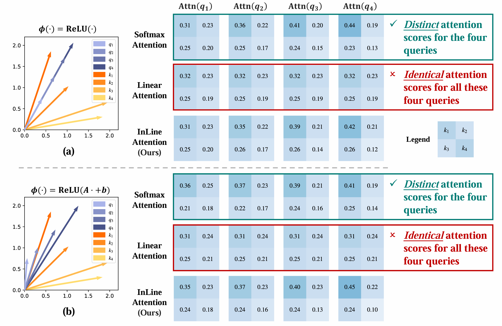
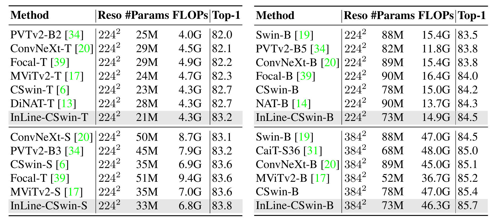

# Bridging the divide: Reconsidering softmax and linear attention

This repo contains the official PyTorch code and pre-trained models for **Injective Linear Attention (InLine)**.

+ [Bridging the divide: Reconsidering softmax and linear attention](https://openreview.net/pdf?id=RSiGFzQapl)


## News

- November 12 2024: Initialize repo.

## Abstract

Widely adopted in modern Vision Transformer designs, Softmax attention can effectively capture long-range visual information; however, it incurs excessive computational cost when dealing with high-resolution inputs. In contrast, linear attention naturally enjoys linear complexity and has great potential to scale up to higher-resolution images. Nonetheless, the unsatisfactory performance of linear attention greatly limits its practical application in various scenarios. In this paper, we take a step forward to close the gap between the linear and Softmax attention with novel theoretical analyses, which demystify the core factors behind the per formance deviations. Specifically, we present two key perspectives to understand and alleviate the limitations of linear attention: the **injective property** and the **local modeling ability**. Firstly, we prove that linear attention is not injective, which is prone to assign identical attention weights to different query vectors, thus adding to severe semantic confusion since different queries correspond to the same outputs. Secondly, we confirm that effective local modeling is essential for the success of Softmax attention, in which linear attention falls short. The aforementioned two fundamental differences significantly contribute to the disparities between these two attention paradigms, which is demonstrated by our substantial empirical validation in the paper. In addition, more experiment results indicate that linear attention, as long as endowed with these two properties, can outperform Softmax attention across various tasks while maintaining lower computation complexity.

## Injectivity of Attention Function

We find that the injectivity of attention function greatly affects the performance of the model. Specifically, *if the attention function is not injective, different queries will induce identical attention distributions, leading to severe semantic confusion within the feature space.* Our prove that the Softmax attention function is an injective function, whereas the linear attention function is not. Therefore, linear attention is vulnerable to the semantic confusion problem, which largely leads to its insufficient expressiveness.

<p align="center">
    
</p>

Our method, **Injective Linear Attention (InLine)**:

$$\mathrm{InL_K}(Q_i) = {\left[
        \phi(Q_i)^\top\phi(K_1),
        \cdots, 
        \phi(Q_i)^\top\phi(K_N)
        \right]}^\top - \frac{1}{N}\sum_{s=1}^{N} \phi(Q_i)^\top\phi(K_s) + \frac{1}{N}.$$


## Results

- ImageNet-1K results.

<p align="center">
    
</p>


- Real speed measurements. Benefited from linear complexity and simple design, our InLine attention delivers much higher inference speed than Softmax attention, especially in high-resolution scenarios.

<p align="center">
    
</p>


## Dependencies

- Python 3.9
- PyTorch == 1.11.0
- torchvision == 0.12.0
- numpy
- timm == 0.4.12
- yacs

The ImageNet dataset should be prepared as follows:

```
imagenet
├── train
│   ├── class1
│   │   ├── img1.jpeg
│   │   └── ...
│   ├── class2
│   │   ├── img2.jpeg
│   │   └── ...
│   └── ...
└── val
    ├── class1
    │   ├── img3.jpeg
    │   └── ...
    ├── class2
    │   ├── img4.jpeg
    │   └── ...
    └── ...
```

## Pretrained Models

| model  | Resolution | #Params | FLOPs | acc@1 |            config            |                      pretrained weights                      |
| ------ | :--------: | :-----: | :---: | :---: | :--------------------------: | :----------------------------------------------------------: |
| InLine-DeiT-T |    224     |   6.5M   | 1.1G  | 74.5  | [config](./cfgs/inline_deit_t.yaml) | [TsinghuaCloud](https://cloud.tsinghua.edu.cn/f/1d6b8191ad6d4114b291/?dl=1) |
| InLine-DeiT-S |    288     |   16.7M   | 5.0G  | 80.2  | [config](./cfgs/inline_deit_s.yaml) | [TsinghuaCloud](https://cloud.tsinghua.edu.cn/f/2f3898b07e9247f3beb3/?dl=1) |
| InLine-DeiT-B |    448     |   23.8M   | 17.2G | 82.3  | [config](./cfgs/inline_deit_b.yaml) | [TsinghuaCloud](https://cloud.tsinghua.edu.cn/f/10bdd726d4b0435eb34e/?dl=1) |
| InLine-PVT-T |    224     |   12.0M   | 2.0G  | 78.2  | [config](./cfgs/inline_pvt_t.yaml) | [TsinghuaCloud](https://cloud.tsinghua.edu.cn/f/90ac52b1555b401eb5e6/?dl=1) |
| InLine-PVT-S |    224     |   21.6M   | 3.9G  | 82.0  | [config](./cfgs/inline_pvt_s.yaml) | [TsinghuaCloud](https://cloud.tsinghua.edu.cn/f/1ab953b2479d433080a3/?dl=1) |
| InLine-PVT-M |    224     |   37.6M   | 6.9G | 83.2  | [config](./cfgs/inline_pvt_m.yaml) | [TsinghuaCloud](https://cloud.tsinghua.edu.cn/f/a72aec31e6084bc0a280/?dl=1) |
| InLine-PVT-L |    224     |   50.2M   | 10.2G | 83.6  | [config](./cfgs/inline_pvt_b.yaml) | [TsinghuaCloud](https://cloud.tsinghua.edu.cn/f/efd91318ba964f01b288/?dl=1) |
| InLine-Swin-T |    224     |   30M   | 4.5G  | 82.4  | [config](./cfgs/inline_swin_t.yaml) | [TsinghuaCloud](https://cloud.tsinghua.edu.cn/f/32810869fcc34410966b/?dl=1) |
| InLine-Swin-S |    224     |   50M   | 8.7G  | 83.6  | [config](./cfgs/inline_swin_s.yaml) | [TsinghuaCloud](https://cloud.tsinghua.edu.cn/f/e9657fd247c04c7cb1a1/?dl=1) |
| InLine-Swin-B |    224     |   88M   | 15.4G | 84.1  | [config](./cfgs/inline_swin_b.yaml) | [TsinghuaCloud](https://cloud.tsinghua.edu.cn/f/bf23564bb64c420aafe1/?dl=1) |
| InLine-CSwin-T |    224     |   25M   | 4.3G  | 83.2  | [config](./cfgs/inline_cswin_t.yaml) | [TsinghuaCloud](https://cloud.tsinghua.edu.cn/f/49fa2ecc543647c4b970/?dl=1) |
| InLine-CSwin-S |    224     |   43M   | 6.8G  | 83.8  | [config](./cfgs/inline_cswin_s.yaml) | [TsinghuaCloud](https://cloud.tsinghua.edu.cn/f/59f4e65f776f4052b93c/?dl=1) |
| InLine-CSwin-B |    224     |   96M   | 14.9G | 84.5  | [config](./cfgs/inline_cswin_b.yaml) | [TsinghuaCloud](https://cloud.tsinghua.edu.cn/f/91e17121df284ae38521/?dl=1) |

## Model Training and Inference

- Evaluate InLine-DeiT/PVT/Swin on ImageNet:

```
python -m torch.distributed.launch --nproc_per_node=8 main.py --cfg <path-to-config-file> --data-path <imagenet-path> --output <output-path> --eval --resume <path-to-pretrained-weights>
```

- To train InLine-DeiT/PVT/Swin on ImageNet from scratch, run:

```
python -m torch.distributed.launch --nproc_per_node=8 main.py --cfg <path-to-config-file> --data-path <imagenet-path> --output <output-path> --amp
```

- Evaluate InLine-CSwin on ImageNet:

```
python -m torch.distributed.launch --nproc_per_node=8 main_ema.py --cfg <path-to-config-file> --data-path <imagenet-path> --output <output-path> --eval --resume <path-to-pretrained-weights>
```

- To train InLine-CSwin on ImageNet from scratch, run:

```
python -m torch.distributed.launch --nproc_per_node=8 main_ema.py --cfg <path-to-config-file> --data-path <imagenet-path> --output <output-path> --amp
```

## Acknowledgements

This code is developed on the top of [Swin Transformer](https://github.com/microsoft/Swin-Transformer). 

## Citation

If you find this repo helpful, please consider citing us.

```latex
@inproceedings{han2024inline,
  title={Bridging the Divide: Reconsidering Softmax and Linear Attention
},
  author={Han, Dongchen and Pu, Yifan and Xia, Zhuofan and Han, Yizeng and Pan, Xuran and Li, Xiu and Lu, Jiwen and Song, Shiji and Huang, Gao},
  booktitle={NeurIPS},
  year={2024},
}
```

## Contact

If you have any questions, please feel free to contact the authors. 

Dongchen Han: [hdc23@mails.tsinghua.edu.cn](mailto:hdc23@mails.tsinghua.edu.cn)
